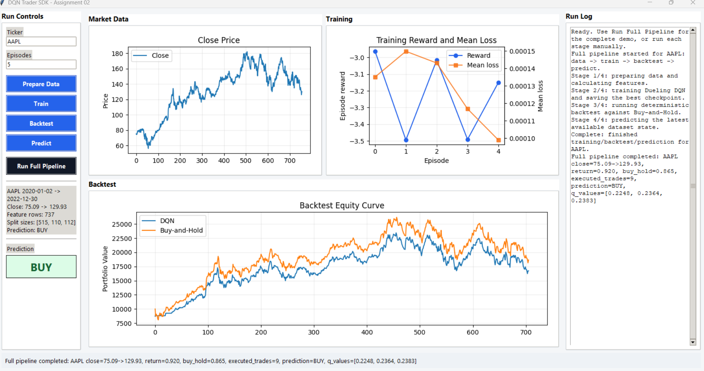
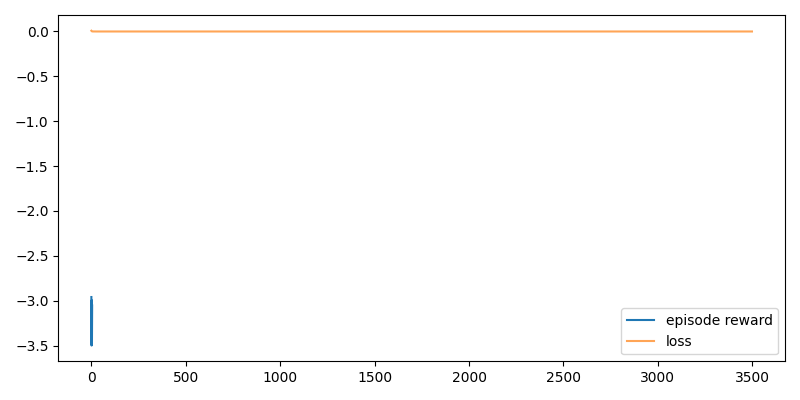
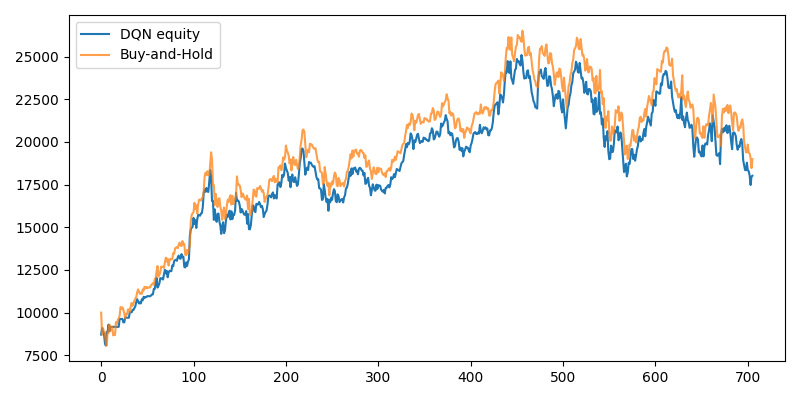
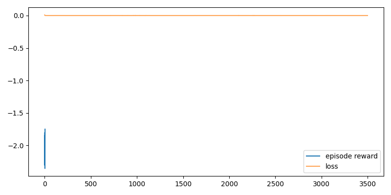
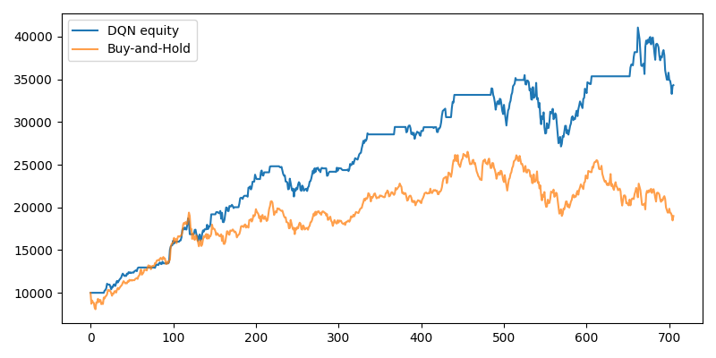
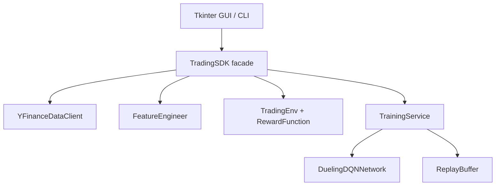

# DQN Trader SDK - Assignment 02

Educational Dueling DQN project for learning Reinforcement Learning through a daily stock-trading environment. This project treats trading as an RL decision problem, not as financial advice and not as next-day price prediction.

## Submission Quick Start
This repository is meant to be checked through the GUI, automated tests, and the experiment report. CLI commands exist for reproducibility, but the main user-facing entry point is the Tkinter dashboard.

## Installation
```powershell
uv sync --extra dev
```

## Run the Required Quality Checks
```powershell
uv run ruff check
uv run ruff format --check
uv run pytest --cov=src --cov-report=term-missing
```

Current local validation after the latest experiment/report pass:

- `ruff check`: passed
- `ruff format --check`: passed
- `pytest`: 25 tests passed, 96.07% coverage

## Run the GUI
```powershell
uv run dqn-trader gui
```

The GUI is the preferred way to demonstrate the project. It includes:

- Run controls for ticker and episode count.
- Data preparation.
- Dueling DQN training.
- Backtest.
- Latest-state action prediction.
- One-click full pipeline: prepare data, train, backtest, predict, and update all plots.
- One dashboard view with market data, training, and backtest plots visible together.
- Always-visible run log and status output.

Actual completed GUI run:



## Experiment Evidence and Work Report
We ran two types of experiments so the submission is clear and honest:

- A required controlled reward comparison on AAPL, using the assignment's 2020-2023 dataset window.
- A broader 10-stock research pass to show the same SDK, DQN model, feature pipeline, and backtest logic running across different market sectors.

The controlled reward-comparison report is here:

[results/experiments/REPORT.md](results/experiments/REPORT.md)

Submission-process evidence is also documented:

- [Assessment coverage matrix](docs/ASSESSMENT_COVERAGE.md)
- [AI-assisted workflow](docs/AI_WORKFLOW.md)
- [AI chat and iteration log](docs/AI_CHAT_LOG.md)
- [Source control and progress evidence](docs/SOURCE_CONTROL.md)
- [Cost and resource analysis](docs/COST_ANALYSIS.md)
- [Version history](docs/VERSION_HISTORY.md)

Summary of the controlled reward-comparison run:

| Run | Ticker | Reward | Episodes | DQN Return | Buy/Hold Return | Sharpe | Max Drawdown | Win Rate | Trades |
|---|---|---|---:|---:|---:|---:|---:|---:|---:|
| AAPL risk-adjusted | AAPL | risk_adjusted | 5 | 1.0678 | 0.8993 | 0.9478 | -0.3035 | 0.4773 | 23 |
| AAPL basic reward | AAPL | basic | 5 | 2.4318 | 0.8993 | 1.7794 | -0.2356 | 0.3244 | 63 |
| Initial SPY attempt | SPY | risk_adjusted | 5 | failed locally | failed locally | failed locally | failed locally | failed locally | failed locally |

The initial SPY attempt failed when only `yfinance.download` was available on this machine because yfinance/curl hit a TLS certificate verification problem. The data client was later improved with a secondary Yahoo Chart API fallback, still using Yahoo Finance data, so the broader research pass completed without manual CSV files.

Important conclusion: these short five-episode runs validate the RL pipeline, reward comparison, plotting, checkpointing, and backtest metrics. They are not proof of a profitable trading strategy.

## Multi-Stock Research
To show that the implementation was not checked only on one or two symbols, the same Dueling DQN pipeline was also run on ten well-known assets across technology, media, consumer, cybersecurity, healthcare, and a market ETF.

Detailed report: [results/multi_stock/REPORT.md](results/multi_stock/REPORT.md)

| Ticker | Company / Asset | Sector | Episodes | DQN Return | Buy/Hold | Sharpe | Max Drawdown | Trades | Prediction |
|---|---|---|---:|---:|---:|---:|---:|---:|---|
| AAPL | Apple | Technology | 3 | 0.9202 | 0.8651 | 0.8880 | -0.3075 | 9 | BUY |
| NVDA | NVIDIA | Semiconductors / AI | 3 | 6.6081 | 1.4253 | 1.8983 | -0.3521 | 250 | HOLD |
| NFLX | Netflix | Streaming media | 3 | -0.0966 | -0.1343 | 0.1755 | -0.7248 | 23 | HOLD |
| META | Meta Platforms | Social media | 3 | -0.1689 | -0.2938 | 0.0837 | -0.7368 | 77 | HOLD |
| SPY | S&P 500 ETF | Market ETF | 3 | 1.3913 | 0.4237 | 2.0071 | -0.0964 | 178 | BUY |
| AMZN | Amazon | E-commerce / cloud | 3 | 0.3786 | -0.0568 | 0.4958 | -0.4694 | 53 | HOLD |
| MCD | McDonald's | Consumer staples / restaurants | 3 | 0.1662 | 0.5013 | 0.5144 | -0.0767 | 6 | HOLD |
| KO | Coca-Cola | Consumer staples | 3 | 1.6473 | 0.3194 | 1.8672 | -0.1783 | 236 | BUY |
| CRWD | CrowdStrike | Cybersecurity | 3 | 1.5637 | 1.6440 | 0.8651 | -0.6590 | 5 | BUY |
| PFE | Pfizer | Healthcare / pharmaceuticals | 3 | 1.3866 | 0.6540 | 1.6787 | -0.1975 | 99 | BUY |

These are compact three-episode diagnostic runs. They show the same algorithm executing across a broader dataset, not a recommendation to trade any of these assets.

Actual AAPL risk-adjusted training and backtest plots:





Actual AAPL basic-reward comparison plots:





## Optional CLI Commands
The GUI is the main demonstration path. These CLI commands run the same SDK flows and are useful for repeatable checks or scripts:

```powershell
uv run dqn-trader prepare --ticker AAPL
uv run dqn-trader train --ticker AAPL
uv run dqn-trader backtest --ticker AAPL
uv run dqn-trader predict --ticker AAPL
uv run python scripts/run_experiments.py
uv run python scripts/run_multi_stock_research.py
```

## RL Mapping
| RL term | Implementation |
|---|---|
| Agent | `DuelingDQNNetwork` policy trained by `TrainingService` |
| Environment | `TradingEnv` with `reset()` and `step(action)` |
| State | Rolling `(30, 10)` tensor of market and portfolio features |
| Action | `SELL=0`, `HOLD=1`, `BUY=2` |
| Reward | Portfolio value change, optionally adjusted by costs and risk |
| Episode | One chronological pass through a historical period |
| Policy | Argmax over Q-values during evaluation; epsilon-greedy during training |
| Return | Discounted cumulative reward estimated through Bellman targets |

## Dataset
The required experiment uses `AAPL` from `2020-01-01` to `2023-01-01`, daily interval, with raw split-adjusted Yahoo-style `Open`, `High`, `Low`, `Close`, and `Volume`. `YFinanceDataClient` calls `yfinance.download(..., auto_adjust=False)` explicitly, stores cache files at `data/raw/{ticker}_{start}_{end}_{interval}_raw.parquet`, and falls back to `data/raw/{ticker}.csv` when online download fails.

Price validation note: an older local cache used dividend-adjusted OHLC values. For example, it showed AAPL close on `2020-01-02` around `72.33`, while Yahoo-style historical data for the same date lists raw split-adjusted close around `75.0875` and volume `135,480,400`. The client and tests were updated so future downloads request raw prices explicitly and use a new cache filename, preventing the adjusted cache from being reused silently.

The feature tensor contains: `log_return`, `rsi_14`, `macd`, `macd_signal`, `macd_hist`, `bb_pct`, `vwap_dist`, `volume_norm`, `position`, and `unrealised_pnl`. Splits are chronological 70/15/15 with no shuffling. Feature calculations use rolling or exponentially weighted past data only; test data is not used for hyperparameter selection.

## DQN Explanation
The network estimates `Q(s,a)`, the expected discounted return of taking action `a` in state `s` and then continuing with the learned policy. It does not predict tomorrow's stock price. Dueling DQN separates state value from action advantage:

```text
Q(s,a) = V(s) + (A(s,a) - mean_a A(s,a))
```

This is useful in trading because many states may make `HOLD` reasonable, while active actions only matter in specific states.

The Bellman target used during training is:

```text
target = reward + gamma * max_a' Q_target(next_state, a') * (1 - done)
```

Training stores `(state, action, reward, next_state, done)` transitions in a regular replay buffer, samples mini-batches, computes Huber loss between selected policy Q-values and Bellman targets, and updates the policy network with Adam. A separate target network is periodically synchronized to stabilize the target. Exploration is epsilon-greedy during training with configured start, minimum, and decay values.

For a fuller code-connected explanation, see [docs/RL_TUTORIAL.md](docs/RL_TUTORIAL.md).

## Architecture


The GUI and CLI call only the SDK. Data, environment, model, memory, training, and evaluation are separated modules under `src/dqn_trader/`.

Invalid actions are handled explicitly in `TradingEnv`: `BUY` while already holding and `SELL` without a position receive `invalid_action_penalty`. The environment uses all-in/all-out positions for clarity.

During backtest and latest-state prediction, the evaluation policy masks impossible actions so the displayed policy is executable. For example, `SELL` is masked when no position is open, and `BUY` is masked while already holding. Training still exposes the agent to invalid-action penalties.

## Experiments
Experiment outputs are split by purpose:

- `results/experiments/` contains the controlled AAPL reward-comparison run and the earlier historical SPY network-failure attempt.
- `results/multi_stock/` contains the later completed 10-stock research pass after adding the Yahoo Chart API fallback.

Controlled reward-comparison files include:

- `results/experiments/REPORT.md`
- `results/experiments/summary.json`
- `results/experiments/<run>/training_metrics.json`
- `results/experiments/<run>/training_curve.png`
- `results/experiments/<run>/backtest_metrics.json`
- `results/experiments/<run>/backtest_equity.png`
- `results/multi_stock/REPORT.md`
- `results/multi_stock/summary.csv`
- `results/multi_stock/summary.json`

Large checkpoint files are intentionally ignored by Git.

## Configuration and Security
Experiment parameters live in `config/setup.yaml`; rate-limit placeholders live in `config/rate_limits.yaml`. `yfinance` does not require API keys, and no secrets are needed. `.env-example` documents that fact. `.gitignore` excludes `.env`, caches, model checkpoints, generated plots, and temporary test/lint artifacts.

## Extension Points
- Add another ticker by passing `--ticker` or changing `config/setup.yaml`.
- Add a feature by extending `FeatureEngineer` and `FEATURE_COLUMNS`.
- Add a reward variant by introducing another `RewardFunction` configuration or strategy.
- Add a model by replacing `DuelingDQNNetwork` behind `TrainingService`.
- Add a metric by extending `BacktestResult` and `BacktestService.save`.

## Known Limitations
- A secondary Yahoo Chart API fallback was added because yfinance/curl had TLS problems on this machine for some symbols.
- The model is intentionally compact for coursework and CPU feasibility.
- Replay is regular replay, not prioritized replay.
- The main GUI screenshot is an actual completed local run; the smaller chart images are demo or experiment artifacts as labeled.

## GUI Guide
Run `uv run dqn-trader gui`. The Tkinter app allows ticker selection, data preparation, Dueling DQN training, backtesting, and latest-state prediction. Use `Run Full Pipeline` for the clean demo path: it pulls/prepares prices, trains, backtests, predicts the latest action, and updates the market, training, and equity plots in one dashboard. The run log stays visible on the side and records the current stage and rough timing expectations instead of only saying "Running". The GUI delegates all logic to `TradingSDK`, preserving the required architecture.

## Visual Demonstration
The images below demonstrate the plot types shown by the GUI. The actual completed GUI run is shown near the top of the README, and real experiment plots are shown earlier under the AAPL experiment section.


To regenerate the demo chart assets:

```powershell
uv run python scripts/generate_readme_assets.py
```

## Testing and TDD Notes
The tests cover configuration, raw-price download arguments, CSV fallback, cache behavior, feature engineering, chronological split, environment actions, reward penalties, replay sampling, Dueling network output shape, checkpoint saving, backtest artifact writing, action masking, and SDK full-pipeline orchestration. Two TDD examples used here are the feature tensor shape test and invalid-action environment test: write failing expectation, implement minimal logic, then refactor into focused modules.

## Questions for Reflection
1. `Q(s,a)` represents expected cumulative reward for an action, while a price forecast predicts a market value.
2. A 30-day by 10-feature continuous state space is too large for a Q-table, so function approximation is required.
3. Reward design shapes the learned policy: transaction costs discourage over-trading, while risk penalties discourage unstable equity curves.
4. Rewarding only immediate profit can create excessive trading and unrealistic backtests.
5. Test data must not influence training or hyperparameters; otherwise future information leaks into the learner.
6. `HOLD` can be optimal during weak signals, high costs, unclear momentum, or already-good positioning.
7. Dueling DQN helps separate "this state is generally good" from "this action is better now".
8. Exploration is stochastic during training; backtest evaluation uses deterministic greedy Q-values.
9. Total return is insufficient; Sharpe, max drawdown, and win rate expose risk and stability.
10. Bad reward signs, future leakage, skipped costs, and invalid action handling can create misleading backtests.
11. A policy is more general if it behaves sensibly on SPY/NVDA and not only on AAPL train data.
12. The same RL structure can model any sequential decision task with states, actions, rewards, and episodes.

## Sources
- Assignment PDF: "Homework 02 - DQN through stock trading environment".
- Lecture PDF: "Learn DQN through stock trading".
- `rmisegal/DQN-stock` reference architecture.
- Mnih et al., Human-level control through deep reinforcement learning.
- Wang et al., Dueling Network Architectures for Deep Reinforcement Learning.
- Schaul et al., Prioritized Experience Replay.
- yfinance and PyTorch documentation.
