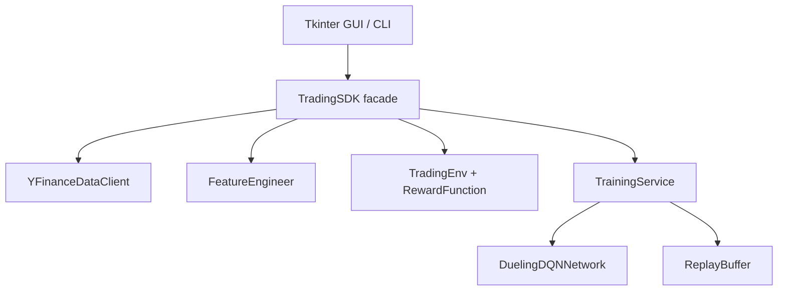
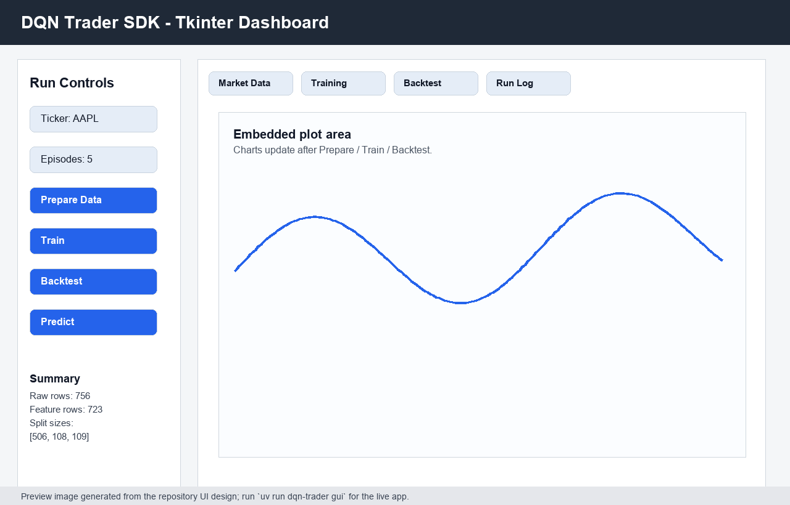
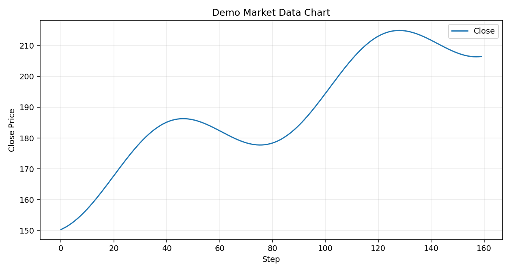
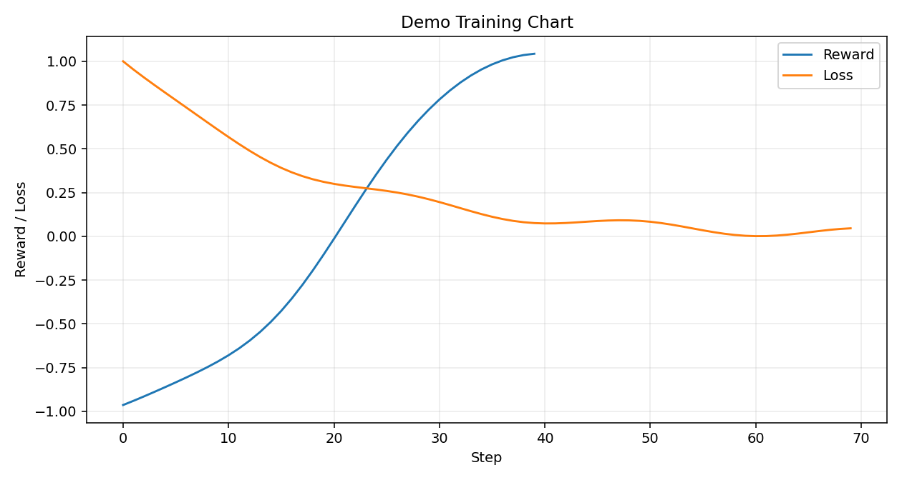
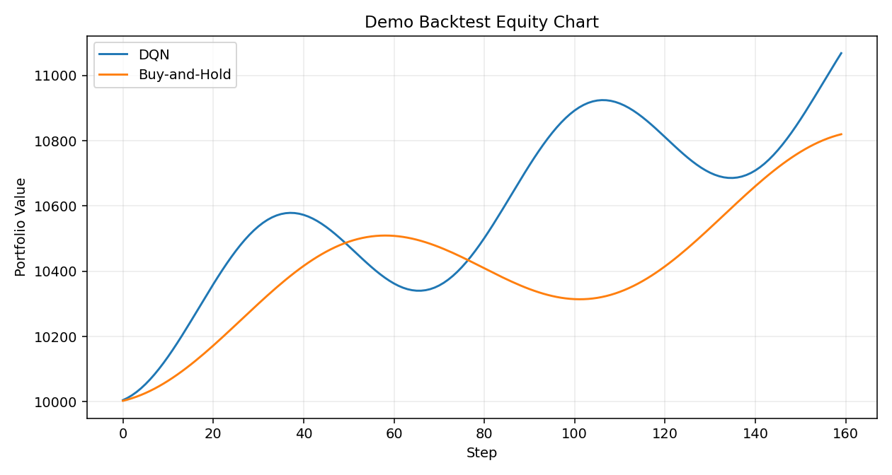

# DQN Trader SDK - Assignment 02

Educational Dueling DQN project for learning Reinforcement Learning through a daily stock-trading environment. This project treats trading as an RL decision problem, not as financial advice and not as next-day price prediction.

## Installation
```powershell
uv sync --extra dev
```

Run checks:
```powershell
uv run ruff check
uv run ruff format --check
uv run pytest --cov=src --cov-report=term-missing
```

Run CLI:
```powershell
uv run dqn-trader prepare --ticker AAPL
uv run dqn-trader train --ticker AAPL
uv run dqn-trader backtest --ticker AAPL
uv run dqn-trader predict --ticker AAPL
uv run dqn-trader gui
```

## RL Mapping
| RL term | Implementation |
|---|---|
| Agent | `DuelingDQNNetwork` policy trained by `TrainingService` |
| Environment | `TradingEnv` with `reset()` and `step(action)` |
| State | Rolling `(30, 10)` tensor of market and portfolio features |
| Action | `SELL=0`, `HOLD=1`, `BUY=2` |
| Reward | Portfolio value change, optionally adjusted by costs and risk |
| Episode | One chronological pass through a historical period |
| Policy | Argmax over Q-values during evaluation; epsilon-greedy during training |
| Return | Discounted cumulative reward estimated through Bellman targets |

## Dataset
The required experiment uses `AAPL` from `2020-01-01` to `2023-01-01`, daily interval, with raw `Open`, `High`, `Low`, `Close`, and `Volume`. `YFinanceDataClient` stores cache files at `data/raw/{ticker}_{start}_{end}.parquet` and falls back to `data/raw/{ticker}.csv` when online download fails.

The feature tensor contains: `log_return`, `rsi_14`, `macd`, `macd_signal`, `macd_hist`, `bb_pct`, `vwap_dist`, `volume_norm`, `position`, and `unrealised_pnl`. Splits are chronological 70/15/15 with no shuffling. Feature calculations use rolling or exponentially weighted past data only; test data is not used for hyperparameter selection.

## DQN Explanation
The network estimates `Q(s,a)`, the expected discounted return of taking action `a` in state `s` and then continuing with the learned policy. It does not predict tomorrow's stock price. Dueling DQN separates state value from action advantage:

```text
Q(s,a) = V(s) + (A(s,a) - mean_a A(s,a))
```

This is useful in trading because many states may make `HOLD` reasonable, while active actions only matter in specific states.

The Bellman target used during training is:

```text
target = reward + gamma * max_a' Q_target(next_state, a') * (1 - done)
```

Training stores `(state, action, reward, next_state, done)` transitions in a regular replay buffer, samples mini-batches, computes Huber loss between selected policy Q-values and Bellman targets, and updates the policy network with Adam. A separate target network is periodically synchronized to stabilize the target. Exploration is epsilon-greedy during training with configured start, minimum, and decay values.

For a fuller code-connected explanation, see [docs/RL_TUTORIAL.md](docs/RL_TUTORIAL.md).

## Architecture


The GUI and CLI call only the SDK. Data, environment, model, memory, training, and evaluation are separated modules under `src/dqn_trader/`.

Invalid actions are handled explicitly in `TradingEnv`: `BUY` while already holding and `SELL` without a position receive `invalid_action_penalty`. The environment uses all-in/all-out positions for clarity.

## Experiments
Required planned runs:

| Run | Ticker | Reward | Purpose |
|---|---|---|---|
| Main | AAPL | risk-adjusted | Required assignment experiment |
| Comparison | SPY | risk-adjusted | Cross-symbol sanity check |
| Reward ablation | AAPL | basic vs risk-adjusted | Show how reward design changes behavior |

Outputs are stored in `results/`: `best_model.pt`, `training_metrics.json`, `training_curve.png`, `backtest_metrics.json`, and `backtest_equity.png`. Large checkpoints may be omitted from GitHub if regeneration commands are documented.

`backtest_metrics.json` includes total return, Buy-and-Hold return, Sharpe ratio, max drawdown, win rate, trade count, and the action sequence. No real experiment results are claimed in this repository before the commands are run locally.

## Configuration and Security
Experiment parameters live in `config/setup.yaml`; rate-limit placeholders live in `config/rate_limits.yaml`. `yfinance` does not require API keys, and no secrets are needed. `.env-example` documents that fact. `.gitignore` excludes `.env`, caches, model checkpoints, generated plots, and temporary test/lint artifacts.

## Extension Points
- Add another ticker by passing `--ticker` or changing `config/setup.yaml`.
- Add a feature by extending `FeatureEngineer` and `FEATURE_COLUMNS`.
- Add a reward variant by introducing another `RewardFunction` configuration or strategy.
- Add a model by replacing `DuelingDQNNetwork` behind `TrainingService`.
- Add a metric by extending `BacktestResult` and `BacktestService.save`.

## Known Limitations
- Real AAPL/SPY experiment results are not committed; run the commands above to generate them.
- The model is intentionally compact for coursework and CPU feasibility.
- Replay is regular replay, not prioritized replay.
- The Tkinter GUI is functional and SDK-based, but screenshots must be captured after local runs if required by the final submission package.

## GUI Guide
Run `uv run dqn-trader gui`. The Tkinter app allows ticker selection, data preparation, Dueling DQN training, backtesting, and latest-state prediction. It includes tabs for market data, training curves, backtest equity curves, and a run log. It delegates all logic to `TradingSDK`, preserving the required architecture.

## Visual Demonstration
The images below are generated preview/demo assets committed under `assets/`. They demonstrate the GUI layout and expected plot types before running a real AAPL/SPY experiment; they are not claimed as real trading results.



Market data plot type:



Training plot type:



Backtest plot type:



To regenerate these README assets:

```powershell
uv run python scripts/generate_readme_assets.py
```

## Testing and TDD Notes
The tests cover configuration, CSV fallback, feature engineering, chronological split, environment actions, reward penalties, replay sampling, Dueling network output shape, checkpoint saving, and SDK orchestration. Two TDD examples used here are the feature tensor shape test and invalid-action environment test: write failing expectation, implement minimal logic, then refactor into focused modules.

## Questions for Reflection
1. `Q(s,a)` represents expected cumulative reward for an action, while a price forecast predicts a market value.
2. A 30-day by 10-feature continuous state space is too large for a Q-table, so function approximation is required.
3. Reward design shapes the learned policy: transaction costs discourage over-trading, while risk penalties discourage unstable equity curves.
4. Rewarding only immediate profit can create excessive trading and unrealistic backtests.
5. Test data must not influence training or hyperparameters; otherwise future information leaks into the learner.
6. `HOLD` can be optimal during weak signals, high costs, unclear momentum, or already-good positioning.
7. Dueling DQN helps separate "this state is generally good" from "this action is better now".
8. Exploration is stochastic during training; backtest evaluation uses deterministic greedy Q-values.
9. Total return is insufficient; Sharpe, max drawdown, and win rate expose risk and stability.
10. Bad reward signs, future leakage, skipped costs, and invalid action handling can create misleading backtests.
11. A policy is more general if it behaves sensibly on SPY/NVDA and not only on AAPL train data.
12. The same RL structure can model any sequential decision task with states, actions, rewards, and episodes.

## Sources
- Assignment PDF: "Homework 02 - DQN through stock trading environment".
- Lecture PDF: "Learn DQN through stock trading".
- `rmisegal/DQN-stock` reference architecture.
- Mnih et al., Human-level control through deep reinforcement learning.
- Wang et al., Dueling Network Architectures for Deep Reinforcement Learning.
- Schaul et al., Prioritized Experience Replay.
- yfinance and PyTorch documentation.
