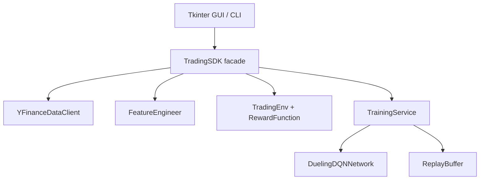

# PLAN: Architecture and Implementation

## Architecture
All consumers call `TradingSDK`. The SDK orchestrates data loading, feature engineering, environment creation, training, evaluation, and inference. GUI and CLI do not import domain internals directly.

## Data Flow
Raw OHLCV data is loaded from Yahoo Finance or CSV fallback, sorted by date, transformed into technical indicators, split chronologically, and exposed as rolling windows of shape `(N, 30, 10)`.

## DQN Design
The model estimates `Q(s,a)` for three actions. Dueling DQN decomposes Q-values into state value and action advantage:

`Q(s,a) = V(s) + (A(s,a) - mean_a A(s,a))`

Training uses epsilon-greedy exploration, replay sampling, Huber loss, Bellman targets, and checkpointing by best episode reward.

## Tradeoffs
- Tkinter is used because it is available in the Python standard library and keeps the submission self-contained.
- A compact MLP is used instead of a large recurrent network to keep runtime and tests manageable.
- `SPY` is the default comparison ticker because it gives a broad-market baseline.
